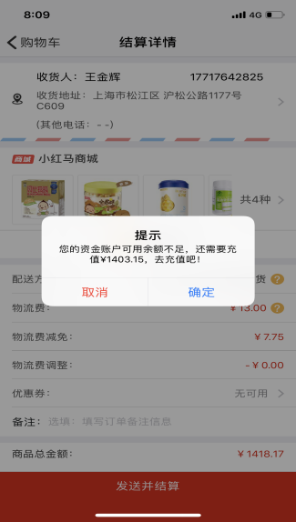
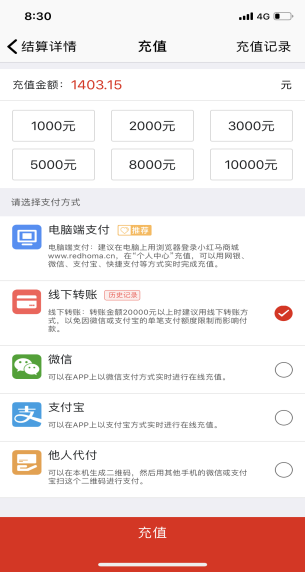

订单问题
==============

1.下单时发现库存不足怎么办？ 

--------------------------

 联系客服查库存，如果客户所属仓库缺货，可以跨区调货下单。小红马在全国有四个自有仓库，某个仓库库存不足时可以从其他仓库调货。

2.为什么结算购物车时已经发送并结算但是没有生成订单？ 

--------------------------------------------------

 在购物车里选择需要购买的产品，选好后发送并结算，这时平台会提示可用余额不足需要充值xx元（如图一所示）点确定进入充值界面，目前支持微信、支付宝、线下转账、他人代付等多种充值方式（如图二所示），买多少充多少不需要多充，充值完成后重新回到购物车结算购物车的产品。只要订单显示在“已发送订单”中，即为订单提交成功。后台会定时审核订单。

（图一）

（图二）

3.订单提交并通过审核后，临时需要修改收货地址怎么办？ 

--------------------------------------------------

 订单已经生成的情况下，如果需要修改收货地址，第一时间联系客服。如果订单还未发货，可以修改收货地址；如果订单已经发货，客服会及时跟进物流并沟通修改地址，已发货商品修改地址可能会产生费用，需要客户承担。

4.下完单突然不想要了怎么办？ 

--------------------------

 当订单状态为“未审核”时，可以撤销订单；当订单状态为“已审核”时，是无法撤销订单的。如果仍然不想要，可以在到货后拒收货物，此单货物的往返运费以及运输过程中的货损费用将从货款中扣除。（退回运费比较高，所以建议客户看好以后下单哦）